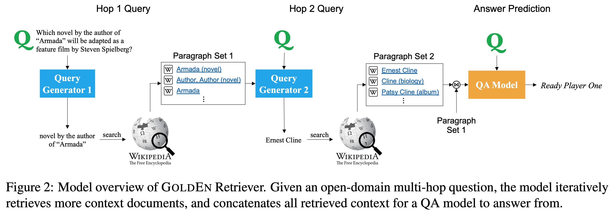

# GoldEn Retriever

This repository contains the authors' implementation of the EMNLP-IJCNLP 2019 paper "[Answering Complex Open-domain Questions Through Iterative Query Generation](https://arxiv.org/pdf/1910.07000.pdf)".

It contains code for GoldEn (Gold Entity) Retriever, an iterative retrieve-and-read system that answers complex open-domain questions. This model answers complex questions that involve multiple steps of reasoning in an open-context open-domain setting (e.g., given the entire Wikipedia). GoldEn Retriever answers these questions by iterating between "reading" the context and generating natural language queries to search for supporting facts to read. It achieves competitive performance on the [HotpotQA leaderboard](https://hotpotqa.github.io/) _without_ using powerful pretrained neural networks such as BERT. Below is an example of how this model answers a complex question by generating natural language queries at each step.




## Training Your Own GoldEn Retriever


### Setting up
Checkout the code from our repository using
```bash
git clone --recursive https://github.com/qipeng/golden-retriever.git
```
This will help you set up submodule dependencies (needed for DrQA). (Equivalently, you can do `git submodule update --init --recursive` after `git clone`)

This repo requires Python 3.6. Please check your shell environment's `python` before proceeding. To use ElasticSearch, make sure you also install Java Development Kit (JDK) version 8.

The setup script will download all required dependencies (python requirements,
data, etc.) required to run the GoldEn Retriever pipeline end-to-end. Before running this script, make sure you have the Unix utility `wget` (which can be installed through anaconda as well as other common package managers).
Along the way, it will also start running Elasticsearch and index the
wikipedia dataset locally.

_Note: This might take a while to finish and requires a large amount of disk space, so it is strongly recommended that you run this on a machine with at least 100GB of free disk space._

```bash
bash setup.sh
```

### Run the model end-to-end

```bash
bash scripts/eval_end_to_end.sh
```

By default, this generates predictions on the HotpotQA dev set in a directory named `outdir`. Take a look at the contents of the `eval_end_to_end.sh` script for more details
or to modify inputs/outputs/model/etc.

### Training model components

#### Hop 1 query generator

1. Generate oracle queries (labels) for the Hop 1 query generator

	```bash
	python -m scripts.gen_hop1 dev && python -m scripts.gen_hop1 train
	```
	This generates Hop 1 oracle queries under `data/hop1`
2. Create dataset

	```bash
	mkdir -p tmp

	python -m scripts.preprocess_hop1 --input_path <path_to_hotpot_hop1_train.json> --output_path ./tmp/hotpot_hop1_squad_train.json
	python -m scripts.preprocess_hop1 --input_path <path_to_hotpot_hop1_dev.json> --output_path ./tmp/hotpot_hop1_squad_dev.json
	```
3. Preprocess with DrQA format

	```bash
	# In the DrQA dir

	python scripts/reader/preprocess.py <path_to_tmp> <path_to_tmp> --split hotpot_hop1_squad_train --workers 4
	python scripts/reader/preprocess.py <path_to_tmp> <path_to_tmp> --split hotpot_hop1_squad_dev --workers 4
	```
4. Sample training code

	```bash
	python scripts/reader/train.py --embedding-file data/embeddings/glove.840B.300d.txt --tune-partial 500 --train-file <path_to_hotpot_hop1_squad_train-processed-corenlp.txt> --dev-file <path_to_hotpot_hop1_squad_dev-processed-corenlp.txt> --dev-json hotpot_hop1_squad_dev.json --hidden-size 128 --parallel True --data-workers 10 --batch-size 32 --test-batch-size 128 --learning-rate 0.001 --model-dir <path_to_model_tmp> --max-len 50 --model-name hop1_model
	```
5. Sample prediction code

	```bash
	python scripts/reader/predict.py data/datasets/hotpot_hop1
	```

#### Hop 2 query generator

1. Generate oracle queries (labels) for the Hop 2 query generator (note this has to be run after Hop 1 oracle queries have been generated)

	```bash
	python -m scripts.gen_hop2 dev && python -m scripts.gen_hop2 train
	```
	This generates Hop 2 oracle queries under `data/hop2`
2. Create DrQA dataset

	Copy the hop2 label json files into DrQA/data/datasets folder, then

	```bash
	python -m scripts.preprocess_hop2 <path_to_DrQA/data/datasets> hotpot_hop2_train.json
	python -m scripts.preprocess_hop2 <path_to_DrQA/data/datasets> hotpot_hop2_dev.json
	```
3.  Preprocess with DrQA format

	```bash
	# In the DrQA dir
	python scripts/reader/preprocess.py data/datasets data/datasets --split SQuAD_hotpot_hop2_dev --workers 4
	python scripts/reader/preprocess.py data/datasets data/datasets --split SQuAD_hotpot_hop2_train --workers 4
	```
4. Sample training code

	```bash
	python scripts/reader/train.py --embedding-file data/embeddings/glove.840B.300d.txt --tune-partial 1000 --max-len 20 --train-file <path_to_SQuAD_hotpot_hop2_train-processed-corenlp.txt> --dev-file <path_to_SQuAD_hotpot_hop2_dev-processed-corenlp.txt> --dev-json <path_to_SQuAD_hotpot_hop2_dev.json> --model-dir <path_to_model_tmp> --model-name hop2_model --expand-dictionary False --num-epochs 40
	```
5. Sample prediction code

	```bash
	python scripts/reader/predict.py <path_to_SQuAD_hotpot_hop2_dev.json> --model <path_to_hop2_model> --embedding-file data/embeddings/glove.840B.300d.txt --out-dir data/datasets
	```

#### BiDAF++ question answering component

1. Generate QA data that is more compatible with the query generators using the oracle queries (note that this needs to be run after Hop 1 and Hop 2 query generation)

	```bash
	python -m scripts.build_qa_data train && python -m scripts.build_qa_data dev-distractor
	# Optionally, run "python -m scripts.build_qa_data dev-fullwiki" to generate a dev set from the oracle queries where the gold paragraphs are not guanranteed to be contained
	```
	This will generate training and dev sets that contain retrieved documents from Wikipedia with the oracle query under `data/hotpotqa` with the suffix `_hops.json`
2. Preprocess the data for the BiDAF++ QA component

	```bash
	# In the BiDAFpp directory
	python main.py --mode prepro --data_file ../data/hotpotqa/hotpot_train_hops.json --para_limit 2250 --data_split train && python main.py --mode prepro --data_file ../data/hotpotqa/hotpot_dev_distractor_hops.json --para_limit 2250 --data_split dev
	```
	Note that the training set has to be preprocessed before the dev set.
3. Train the BiDAF++ QA component

	```bash
	python main.py --mode train --para_limit 2250 --batch_size 64 --init_lr 0.001 --patience 3 --keep_prob .9 --sp_lambda 10.0 --period 20 --max_grad_norm 5 --hidden 128
	```
4. Sample code for predicting from the trained QA component

	```bash
	python main.py --mode prepro --data_file <input_file> --para_limit 2250 --data_split test --fullwiki # preprocess the input data
  	python main.py --mode test --data_split test --save <trained_model_directory> --prediction_file <output_file_name> --sp_threshold .33 --sp_lambda 10.0 --fullwiki --hidden 128 --batch_size 16
  	```

## Citation

If you use GoldEn Retriever in your work, please consider citing our paper

```
@inproceedings{qi2019answering,
  author={Qi, Peng and Lin, Xiaowen and Mehr, Leo and Wang, Zijian and Manning, Christopher D.},
  booktitle={2019 Conference on Empirical Methods in Natural Language Processing and 9th International Joint Conference on Natural Language Processing ({EMNLP-IJCNLP})},
  title={Answering Complex Open-domain Questions Through Iterative Query Generation},
  url={https://nlp.stanford.edu/pubs/qi2019answering.pdf},
  year={2019}
}
```

## License

All work contained in this package is licensed under the Apache License, Version 2.0. See the included LICENSE file.
